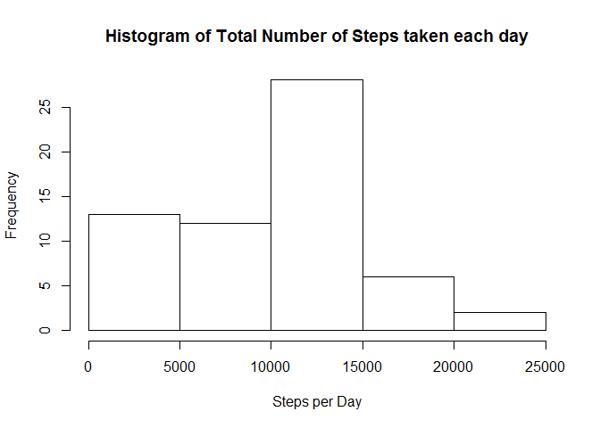
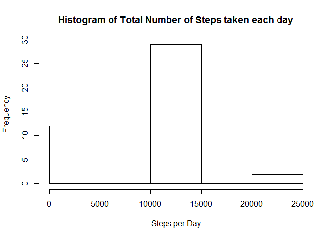
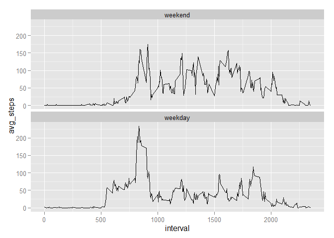

# Reproducible Research: Peer Assessment 1
Herbert Amaya  


## Loading and preprocessing the data

```r
knitr::opts_chunk$set(fig.path='figure/',echo=TRUE)
data <- read.csv(unz("activity.zip","activity.csv"))
library(dplyr)
```

```
## 
## Attaching package: 'dplyr'
## 
## The following objects are masked from 'package:stats':
## 
##     filter, lag
## 
## The following objects are masked from 'package:base':
## 
##     intersect, setdiff, setequal, union
```


## What is mean total number of steps taken per day?

```r
data.dailyStepsAvg <- group_by(data,date)
data.dailyStepsAvg <- summarize(data.dailyStepsAvg,steps=sum(steps,na.rm=TRUE))
hist(data.dailyStepsAvg$steps,main = "Histogram of Total Number of Steps taken each day",xlab = "Steps per Day")
```

 

```r
mean(data.dailyStepsAvg$steps,na.rm=TRUE)
```

```
## [1] 9354.23
```

```r
median(data.dailyStepsAvg$steps,na.rm = TRUE)
```

```
## [1] 10395
```

## What is the average daily activity pattern?

```r
data.intervalAvg <- group_by(data,interval)
data.intervalAvg <- summarize(data.intervalAvg,avg_steps=mean(steps,na.rm=TRUE))
library(ggplot2)
ggplot(data.intervalAvg,aes(interval,avg_steps)) + geom_line()
```

 

```r
fiveMin.Interval.MaxSteps = arrange(data.intervalAvg,desc(avg_steps))[1,]
print.data.frame(fiveMin.Interval.MaxSteps)
```

```
##   interval avg_steps
## 1      835  206.1698
```

## Imputing missing values

```r
missingValues <- sapply(data, function(x) sum(is.na(x)))
print(missingValues)
```

```
##    steps     date interval 
##     2304        0        0
```
Filling in the missing values with the mean for the 5-minute interval

```r
data.noMissing <- 
    mutate(data,
           steps=ifelse(is.na(steps),
                        data.intervalAvg[which(data.intervalAvg$interval == interval),]$avg_steps
                        ,steps))
```
Histogram of the total number of steps taken each day

```r
data.dailyStepsAvg <- group_by(data.noMissing,date)
data.dailyStepsAvg <- summarize(data.dailyStepsAvg,steps=sum(steps,na.rm=TRUE))
hist(data.dailyStepsAvg$steps,main = "Histogram of Total Number of Steps taken each day",xlab = "Steps per Day")
```

 

```r
mean(data.dailyStepsAvg$steps,na.rm=TRUE)
```

```
## [1] 9530.724
```

```r
median(data.dailyStepsAvg$steps,na.rm = TRUE)
```

```
## [1] 10439
```
###Do these values differ from the estimates from the first part of the assignment? 
Yes, they slightly differ.

###What is the impact of imputing missing data on the estimates of the total daily number of steps?
Imputing missing data increases the amount of 'valid data' for the analysis, thus weighting on the final results.

## Are there differences in activity patterns between weekdays and weekends?

```r
weekend.labels <- c("Saturday","Sunday")
day_type.levels <- c("weekend","weekday")
data.weekdays <- mutate(data.noMissing,day_type = factor(ifelse(weekdays(as.Date(date)) %in% weekend.labels,"weekend","weekday"),levels = day_type.levels))

data.weekdays.intervalAvg <- group_by(data.weekdays,interval,day_type)
data.weekdays.intervalAvg <- summarize(data.weekdays.intervalAvg,avg_steps=mean(steps,na.rm=TRUE))

q <- qplot(interval,avg_steps,data=data.weekdays.intervalAvg,facets=.~day_type,geom ="line") + facet_wrap( ~ day_type, nrow=2) 
print(q)
```

 
